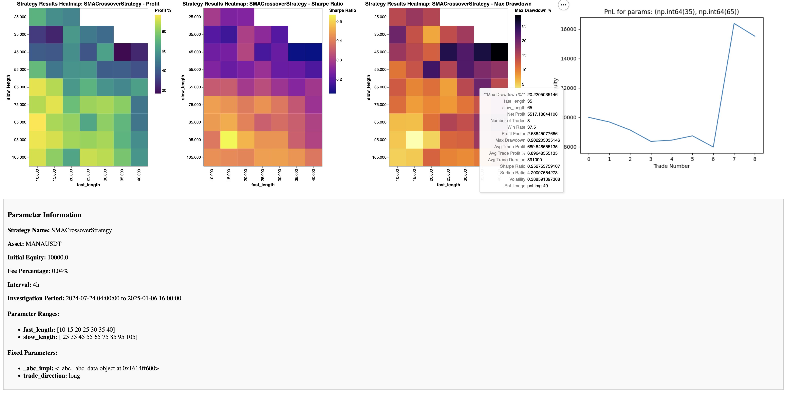

# Damian's Heatmap Generator



Welcome to Damian's Heatmap Generator, a sophisticated tool designed to analyze trading strategies and visualize their performance through interactive heatmaps.

## Project Background

As a PHP open-source developer venturing into Python, I created this project in collaboration with AI tools (GPT and Claude) and the Cursor IDE. The goal was to build a framework that could convert trading strategies from platforms like TradingView, MetaTrader, or ProRealTime into Python. The framework allows for debugging with `pnl.py` and `chart_analysis.py` to ensure identical signal generation and performance before creating parameter-based heatmaps.

## Overview

Damian's Heatmap Generator allows users to:
- Convert trading strategies from various platforms to Python using AI
- Verify strategy performance through profit/loss analysis
- Compare trade signals with original strategies
- Generate performance heatmaps by varying two parameters while keeping others fixed

## Strategy Conversion Process

1. **AI-Assisted Conversion**
   - Use AI to convert strategies to Python using `macd_strategy.py` as a template
   - Place new strategies in `classes/strategies` directory
   - Support for TradingView, MetaTrader, ProRealTime, and other platforms

2. **Debugging Process**
   - Use `pnl.py` for profit/loss verification
   - Use `chart_analysis.py` for signal comparison
   - Iterate until results match original strategy
   - Prefer simplified strategies for faster heatmap generation

3. **Parameter Configuration**
   When modifying dynamic parameters or long/short behavior, adjust these methods in the strategy class:
   - `__init__`
   - `parameter_ranges`
   - `get_parameters`

## Features

### Analysis Tools
- **PnL Analysis**: Comprehensive profit and loss calculations via `pnl.py`
- **Visual Verification**: Plotly charts showing indicators and entry/exit signals overlaid on price data
- **Strategy Comparison**: One-to-one trade comparison with original strategy

### Visualization
- **Multi-Metric Heatmaps**: 2D heatmaps for Profit, Sharpe Ratio, and Drawdown
- **Interactive Elements**: PnL calculations displayed on heatmap hover
- **Browser Integration**: Results viewed through Plotly and Altair visualizations

### Technical Features
- **Data Management**: OHLC data fetching and caching via Coincopy and Binance APIs
- **Performance**: Multi-core parallelization for heatmap generation
- **Strategy Support**: Comprehensive long and short strategy capabilities

## Getting Started

### Prerequisites

- Python 3.7 or higher
- Required Python packages:
```bash
pandas
numpy
matplotlib
altair
altair_saver
tqdm
requests
plotly
webbrowser
platform
subprocess
decimal
```

### Installation

1. Clone the repository:
```bash
git clone https://github.com/damianhunziker/damiansHeatmapGenerator
cd heatmap_generator
```

2. Install the required packages using `requirements.txt`:
```bash
pip install -r requirements.txt
```

### Usage

1. **Run the Heatmap Generator**:
```bash
python heatmap.py
```
   - The heatmap and analysis results will be saved as an HTML file and automatically opened in your default web browser.

2. **Run Profit and Loss Analysis**:
```bash
python pnl.py
```
   - This script will calculate and display the profit and loss of your strategy.

3. **Run Chart Analysis**:
```bash
python chart_analysis.py
```
   - This script will generate visualizations to compare entry and exit signals with the original strategy.

## Contributing

Contributions are welcome! Please fork the repository and submit a pull request with your improvements.

## Acknowledgments

This project was developed with extensive use of AI, which provided valuable insights and optimizations throughout the development process. Special thanks to GPT, Claude and Cursor IDE, that made this project possible.

## License

This project is licensed under the Creative Commons Attribution-NonCommercial-ShareAlike 4.0 International License - see the [LICENSE](LICENSE) file for details.