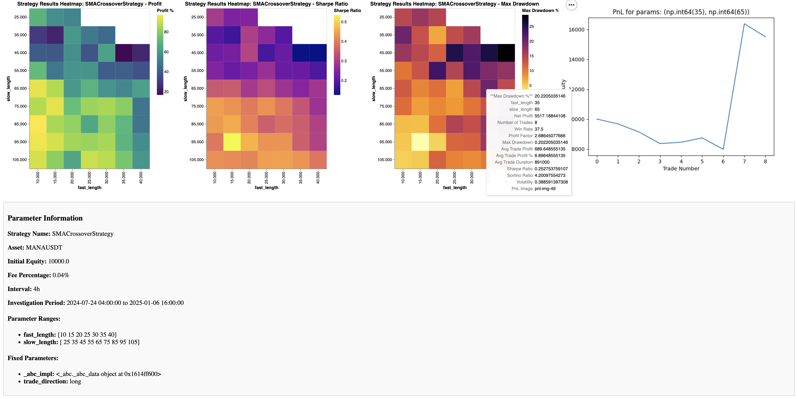

# Damian's Heatmap Generator



Welcome to Damian's Heatmap Generator, a sophisticated tool designed to analyze trading strategies and visualize their performance through interactive heatmaps.

## Project Background

As a PHP open-source developer venturing into Python, I created this project in collaboration with AI tools (GPT and Claude) and the Cursor IDE. The goal was to build a framework that could convert trading strategies from platforms like TradingView, MetaTrader, or ProRealTime into Python. The framework allows for debugging with `pnl.py` and `chart_analysis.py` to ensure identical signal generation and performance before creating parameter-based heatmaps.

## Overview

Damian's Heatmap Generator allows users to:
- Convert trading strategies from various platforms to Python using AI
- Verify strategy performance through profit/loss analysis
- Compare trade signals with original strategies
- Generate performance heatmaps by varying two parameters while keeping others fixed

## Strategy Conversion Process

1. **AI-Assisted Conversion**
   - Use AI to convert strategies to Python using `macd_strategy.py` as a template
   - Place new strategies in `classes/strategies` directory
   - Support for TradingView, MetaTrader, ProRealTime, and other platforms

2. **Debugging Process**
   - Use `pnl.py` for profit/loss verification
   - Use `chart_analysis.py` for signal comparison
   - Iterate until results match original strategy
   - Prefer simplified strategies for faster heatmap generation

3. **Parameter Configuration**
   When modifying dynamic parameters or long/short behavior, adjust these methods in the strategy class:
   - `__init__`
   - `parameter_ranges`
   - `get_parameters`

## Features

### Analysis Tools
- **PnL Analysis**: Comprehensive profit and loss calculations via `pnl.py`
- **Visual Verification**: Plotly charts showing indicators and entry/exit signals overlaid on price data
- **Strategy Comparison**: One-to-one trade comparison with original strategy

### Visualization
- **Multi-Metric Heatmaps**: 2D heatmaps for Profit, Sharpe Ratio, and Drawdown
- **Interactive Elements**: PnL calculations displayed on heatmap hover
- **Browser Integration**: Results viewed through Plotly and Altair visualizations

### Technical Features
- **Data Management**: OHLC data fetching and caching via Coincopy and Binance APIs
- **Performance**: Multi-core parallelization for heatmap generation
- **Strategy Support**: Comprehensive long and short strategy capabilities

## Getting Started

### Prerequisites

- Python 3.7 or higher
- Required Python packages:
```bash
pandas
numpy
matplotlib
altair
altair_saver
tqdm
requests
plotly
webbrowser
platform
subprocess
decimal
```

### Installation

1. Clone the repository:
```bash
git clone https://github.com/damianhunziker/damiansHeatmapGenerator
cd heatmap_generator
```

2. Install the required packages using `requirements.txt`:
```bash
pip install -r requirements.txt
```

### Usage

1. **Run the Heatmap Generator**:
```bash
python heatmap.py
```
   - The heatmap and analysis results will be saved as an HTML file and automatically opened in your default web browser.

2. **Run Profit and Loss Analysis**:
```bash
python pnl.py
```
   - This script will calculate and display the profit and loss of your strategy.

3. **Run Chart Analysis**:
```bash
python chart_analysis.py
```
   - This script will generate visualizations to compare entry and exit signals with the original strategy.

## Viewing generated reports

Every tool now writes its HTML output to disk and prints a clickable link instead of relying on `fig.show()` / a local browser (which does not exist inside the container):

```
========================================================================
  Chart Analysis
  http://localhost:8900/html_cache/chart_analysis_LiveKAMASSLStrategy_BTCUSDT_4h_20240101_120000.html
========================================================================
```

The link is served by a small static viewer. On the host the file is opened in the default browser automatically; inside Docker the printed URL is the way to reach it. An index page links to all generated reports:

- Reports index: `http://localhost:8900/html_cache/viewer.html`
- Browse all files: `http://localhost:8900/`

Output locations:

| Tool | Output |
|------|--------|
| `chart_analysis.py` | `html_cache/chart_analysis_<Strategy>_<Asset>_<Interval>_<timestamp>.html` |
| `pnl.py` | `html_cache/results.html` (plus `chart_both/long/short.html`) |
| `heatmap.py` | `html_cache/<Strategy>_<Asset>_<Interval>_..._candles_<n>.html` |
| `automator.py` | `automator_html/run_<timestamp>/<PAIR>/html/...` |

The viewer port is configurable via `HEATMAP_VIEWER_PORT` (default `8900`) and the public host via `HEATMAP_VIEWER_HOST` (default `localhost`).

## Docker / Dev Container

The project ships with a `Dockerfile`, `docker-compose.yml` and a `.devcontainer/` setup. Two services are defined:

| Service | Purpose |
|---------|---------|
| `app` | The Python toolchain (kept alive with `sleep infinity`); run the scripts here |
| `viewer` | Persistent static server for the generated HTML reports, bound to `127.0.0.1:8900` |

Start both:

```bash
docker compose up -d
```

Run a tool inside the app container and open the printed link on the host:

```bash
docker compose exec app python test.py chart_analysis \
    --start_date="2024-01-01" --end_date="2024-03-01" \
    --asset="BTCUSDT" --strategy="LiveKAMASSLStrategy" --interval="4h"
```

The viewer only binds to `127.0.0.1` on the host; it is never exposed to the network.

## Chart Analysis (`chart_analysis.py`)

`chart_analysis.py` is the visual verification tool of the framework. It replays a strategy over historical OHLC data, simulates the resulting trades, and renders everything as a single interactive Plotly chart so you can visually compare the strategy's entry/exit logic against the price action, its indicators, divergences and pivots. It is the main tool for the "Debugging Process" described above (signal comparison) before running a heatmap.

### What it does

1. Loads OHLC data for the chosen asset/interval from `ohlc_cache/` and fetches it via `OHLCFetcher` if it is missing.
2. Discovers all strategies in `classes/strategies/*_strategy.py` and instantiates the selected one.
3. Runs the strategy (`prepare_signals`) to compute indicators and entry/exit signals.
4. Simulates trades with `TradeAnalyzer` (`classes/trade_analyzer.py`), including fees and opposite-direction exits, and records an exit reason per trade.
5. Prints a full trade list and summary statistics to the console.
6. Builds the interactive chart, opens it in the default browser (`fig.show()`), and returns the Plotly `Figure` object.

### Chart components (subplot layout)

The chart is a vertically stacked Plotly figure with a shared x-axis. Row order:

| Row | Content |
|-----|---------|
| 1 | **Price** — candlesticks plus overlays and trade/divergence/pivot markers |
| 2 | **Entry KAMA Delta** — delta line + limit (dashed) |
| 3 | **Exit KAMA Delta** — delta line + limit (dashed) |
| 4 | **Fusion Range Filter** — only when `use_fusion_for_long` is enabled |
| 5…n | one row per **divergence indicator** (long and short profile) |

Row 1 overlays and markers:

- SSL Up (green) / SSL Down (red) and DEMA (purple) when available.
- Bollinger Bands (basis/upper/lower) and, for long trades, Entry KAMA / KAMA2 / Exit KAMA.
- Trade markers: long entry (blue triangle right), long exit (green triangle left), short entry (red triangle right), short exit (green triangle left); hover shows price and exit reason.
- Divergence lines: bearish divergences for the long profile (dark red = confirmed, pink = unconfirmed) and bullish divergences for the short profile (dark green = confirmed, light green = unconfirmed).
- Pivot points: long-profile pivot highs (dark red triangle down) and short-profile pivot lows (dark green triangle up).
- Fusion Range Filter background: gray rectangles mark candles where the filter condition (MA > ATR) is active.

The Fusion Range Filter row (row 4) plots the Fusion MA line (blue), the scaled ATR limit (red dashed) and a gray fill for active periods. Each divergence row plots the indicator values and draws its divergence segments as line shapes.

Controls: two buttons (`Hide Pivot Points` / `Show Pivot Points`) toggle the pivot markers via Plotly `restyle`. The figure height is computed from the number of subplots (price chart 800 px, each indicator 400 px, capped at 3000 px).

### Options

`chart_analysis.py` can be run in two ways.

#### 1. Interactive

```bash
python chart_analysis.py
```

Prompts (in order):

| Prompt | Default | Notes |
|--------|---------|-------|
| Select strategy number | 1 | from the auto-discovered list |
| Enter asset | `BTCUSDT` | e.g. `SOLUSDT` |
| Enter interval per timeframe | strategy default (e.g. `4h`) | `1m, 5m, 15m, 1h, 4h, 1d` |
| Refetch data? | `N` | only asked if a cache file exists |
| Enter start date | earliest cache date | validated against the cache range |
| Enter end date | latest cache date | must be ≥ start date |
| Enter initial equity | `1000` | |
| Enter fee percentage | `0.04` | in percent |
| Strategy parameters | from `get_parameters()` | e.g. entry/exit filter |

#### 2. Non-interactive via `test.py`

```bash
python test.py chart_analysis --start_date="2024-01-01" --end_date="2024-03-01" \
    --asset="BTCUSDT" --strategy="LiveKAMASSLStrategy" --interval="4h"
```

Common parameters:

| Parameter | Required | Default | Description |
|-----------|----------|---------|-------------|
| `--start_date` | yes | – | `YYYY-MM-DD` |
| `--end_date` | yes | – | `YYYY-MM-DD` |
| `--asset` | yes | – | e.g. `BTCUSDT` |
| `--strategy` | yes | – | strategy class name, e.g. `LiveKAMASSLStrategy` |
| `--interval` | no | `4h` | one of `1m, 5m, 15m, 30m, 1h, 2h, 4h, 6h, 8h, 12h, 1d` |
| `--initial_equity` | no | `10000` | starting equity |
| `--fee_pct` | no | `0.04` | fee per side in percent |

Strategy-specific parameters are read from `get_parameters()` and defaulted automatically; any of them can be overridden on the command line:

```bash
python test.py chart_analysis --start_date="2024-01-01" --end_date="2024-03-01" \
    --asset="BTCUSDT" --strategy="LiveKAMASSLStrategy" \
    --entry_filter=0.7 --exit_filter=1.0 --use_fusion_for_long=true \
    --atr_length=9 --hma_mode=VWMA --hma_length=50 --atr_scaling_factor=1.4
```

For `LiveKAMASSLStrategy`, `get_parameters()` exposes: `entry_filter`, `exit_filter`, `calculate_divergences`, `use_fusion_for_long`, `atr_length`, `hma_mode`, `hma_length`, `atr_scaling_factor`. The constructor additionally understands `trade_direction` (`long`/`short`/`both`), `debug_mode`, `indicators`, `short_indicators`, `show_pivot_points`, `position_sizing_method`, `position_size_value`, `max_position_size`, `allow_continuous_entries` and the divergence exit flags (`use_divergence_exit_long`, `use_hidden_divergence_exit_long`, `use_divergence_exit_short`, `use_hidden_divergence_exit_short`).

> Note: `python test.py --schema` currently does not list `chart_analysis` parameters because `chart_analysis.py` does not define a `ChartAnalysis` class. Use the tables above as the reference.

### What is printed / output

Console output includes:

- Strategy/initialization and data diagnostics (shape, columns, date range).
- A **trade list** table: `#`, `Type` (LONG/SHORT), `Entry Time`, `Exit Time`, `Entry`, `Exit`, `Gross P/L`, `Fees`, `Net P/L`, `%`, `Exit Reason`.
- **Summary statistics**: initial equity, final equity, total return, total profit, total fees, number of trades, win rate, average profit per trade.
- The divergence indicator list, pivot counts and Fusion Range Filter statistics.

Exit reasons can be e.g. `KAMA exit signal`, `SSL exit signal`, `Realtime BB Cross Exit`, `Bearish divergence exit`, `Bullish divergence exit`, `SSL crossover up exit`, `DEMA crossover exit`, or `Opposite Entry` (the position was closed because the opposite direction signalled).

Generated artifacts:

- `ohlc_cache/<ASSET>_<INTERVAL>_ohlc.csv` — the data cache (created/updated by the fetcher).
- `html_cache/chart_analysis_<Strategy>_<Asset>_<Interval>_<timestamp>.html` — the interactive chart, also linked in the viewer index.

### Components

| Component | Role |
|-----------|------|
| `chart_analysis.py` | `create_interactive_chart()` builds and shows the figure; `create_chart()` helper; interactive `__main__` |
| `core/strategy_utils.py` | `get_user_inputs()`, `get_strategy_inputs()`, `get_available_strategies()`, `fetch_data()` |
| `classes/trade_analyzer.py` | `TradeAnalyzer.analyze_data()` / `_generate_trades()` — signal replay, trade simulation, fees, exit reasons |
| `classes/base_strategy.py` | `BaseStrategy` contract (`get_parameters`, `prepare_signals`, …) |
| `classes/strategies/*_strategy.py` | concrete strategy; provides `prepare_signals()`, `add_strategy_traces()`, `get_parameters()`, `get_required_timeframes()` |
| `classes/indicators/*` | divergence detection, Fusion Range Filter, volume zones |
| `classes/data_fetcher.py` | `OHLCFetcher` for exchange data and caching |

### Example

```bash
# Interactive
python chart_analysis.py

# Non-interactive
python test.py chart_analysis --start_date="2024-01-01" --end_date="2024-03-01" \
    --asset="BTCUSDT" --strategy="LiveKAMASSLStrategy" --interval="4h"
```

## Machine-readable API (`--api`)

Every tool can be run as a JSON API by adding `--api` to any `test.py` call.
With `--api` the process writes **exactly one JSON object to stdout** (all
normal console output is redirected to stderr), so it can be consumed by
scripts, agents and MCP servers.

```bash
python test.py pnl --asset=BTCUSDT --strategy=LiveKAMASSLStrategy \
    --start_date=2024-01-01 --end_date=2024-03-01 --api
```

The response is always wrapped in the same envelope:

```json
{
  "ok": true,
  "tool": "pnl",
  "params": { "...": "..." },
  "data": { "...": "..." },
  "artifacts": [{"path": "/app/html_cache/results.html",
                 "url": "http://localhost:8900/html_cache/results.html"}],
  "warnings": [],
  "error": null,
  "duration_ms": 3719
}
```

Schema (tools, strategy parameters, parameter ranges, intervals):

```bash
python test.py --schema --api
```

### Tools and their `data` payload

| Tool | `data` contents |
|------|-----------------|
| `pnl` | `directions.{both,long,short}` with `metrics`, `trades`, `equity_curve`, `equity_curve_timestamps`, `pnl_performance`, `buy_hold`, `drawdown` |
| `chart_analysis` | `summary` (equity, return, win rate, …), `trades`, `divergence_indicators` |
| `heatmap` | `grid` (one entry per parameter combination), `best` (top-N by profit/net_profit/sharpe/drawdown), `robustness` (3×3 neighbourhood mean/min), `param_ranges`, `x_param`, `y_param` |
| `automator` | `output_dir`, `runs[]` (per pair: `ok`, `error`, `best`, `grid`, `artifact`) |
| `fetcher` | `asset`, `interval`, `rows`, `start`, `end`, `cache_path` |
| `series` | per-candle indicator/signal series (see below) |

Heatmap parameter grids are passed as JSON. A grid of `0.7..0.9` (step `0.1`)
× `1.0..1.1` (step `0.1`) with PnL images disabled:

```bash
python test.py heatmap --asset=BTCUSDT --strategy=LiveKAMASSLStrategy \
    --start_date=2024-01-01 --end_date=2024-03-01 --no_images --workers=1 \
    '--param_ranges={"entry_filter":{"min":0.7,"max":0.9,"step":0.1},"exit_filter":{"min":1.0,"max":1.1,"step":0.1}}' \
    --api
```

`--no_images` skips the per-cell PnL PNG generation (much faster, ideal for
agents). `--workers N` controls the multiprocessing pool (`--workers 1` runs
serially). `--max_combos` (default `400`) guards against accidental huge grids.

### Choosing heatmap parameters (free selection)

The swept parameters are **passed at call time** via `--param_ranges` / the
`param_ranges` argument — they are **not hardcoded**. Any keyword argument the
strategy constructor accepts can be swept; the strategy's
`get_parameter_ranges()` is only the default when `param_ranges` is omitted.

Each value may be a list of explicit values, or a spec:

| Form | Example |
|------|---------|
| list of values (numeric, categorical or boolean) | `{"hma_mode": ["VWMA","HMA"], "use_fusion_for_long": [true,false]}` |
| `{min, max, step}` | `{"entry_filter": {"min":0.5,"max":1.5,"step":0.25}}` |
| `{min, max, count}` | `{"entry_filter": {"min":0.5,"max":1.5,"count":5}}` |

Constraints to keep in mind:

- **Exactly 2 parameters.** The heatmap is 2D: the first two keys become the x/y
  axes (`x_param`, `y_param`). One parameter raises an error; three or more are
  computed but only the first two are visualised, so the `robustness` pivot
  becomes ambiguous. Pass exactly two.
- **Unknown names are silently dropped.** The strategy is instantiated with only
  the kwargs it accepts, so a typo makes that axis constant (all cells
  identical) instead of raising. Sanity-check the grid: if `x`/`y` (or the
  metric column) has a single distinct value, the parameter was not applied.
- **Categorical / boolean** values work as lists; the axis number formatting is
  cosmetic only.
- **The human CLI (`test.py heatmap` without `--api`) ignores `--param_ranges`**
  and always uses `strategy_class.get_parameter_ranges()`. Free selection is
  available via `--api` and the MCP tool.

The result contains `grid` (all combinations with metrics), `best` (top-N by
profit / net_profit / sharpe / drawdown) and `robustness` (3×3 neighbourhood
`neighbor_mean` / `neighbor_min`). Prefer **plateaus** over spikes: a stable
cell has a small `|profit − neighbor_mean|` and a `neighbor_min` not far below
`profit`. Confirm the plateau on a different date range and across pairs with
`automator`.

### Runtime debugging with `series`

`series` returns per-candle indicator and signal columns so a model can answer
"why did this trade / no trade happen?". Small results are returned inline;
large results are written to a Parquet file (falls back to CSV if `pyarrow` is
missing) and only the path is returned — query it with DuckDB.

```bash
python test.py series --asset=BTCUSDT --strategy=LiveKAMASSLStrategy \
    --start_date=2024-01-01 --end_date=2024-02-01 \
    --columns price_close,long_entry,short_entry,long_exit,short_exit,exit_reason \
    --tail 500 --api
```

Options: `--columns a,b,c`, `--tail N`, `--format json|parquet`,
`--inline_max_cells N` (default `5000`).

## MCP server

`mcp_server/server.py` exposes the API over the Model Context Protocol (stdio).
It calls `python test.py <tool> ... --api` as a subprocess (keeping the MCP
stdout channel clean) and returns the JSON envelope. It opens no network ports.

Tools: `get_schema`, `fetch_data`, `run_pnl`, `run_chart_analysis`,
`run_heatmap`, `run_automator`, `get_series`, `run_tool`, `list_artifacts`,
`read_artifact`.

Because the strategy dependencies (TA-Lib, ccxt, ib_async) live in the Docker
image, run the server inside the `app` container:

```bash
docker exec -i damians-heatmap-dev python mcp_server/server.py
```

An MCP client (e.g. `opencode.json`) is configured as:

```json
"damians-heatmap": {
  "type": "local",
  "command": ["docker", "exec", "-i", "damians-heatmap-dev", "python", "mcp_server/server.py"],
  "enabled": true,
  "timeout": 600000,
  "autoApprove": ["get_schema", "fetch_data", "run_pnl", "run_chart_analysis", "get_series", "list_artifacts", "read_artifact"]
}
```

Environment overrides: `HEATMAP_PROJECT_ROOT`, `HEATMAP_PYTHON`,
`HEATMAP_MCP_TIMEOUT` (subprocess timeout in seconds, default `1500`).

## Contributing

Contributions are welcome! Please fork the repository and submit a pull request with your improvements.

## Acknowledgments

This project was developed with extensive use of AI, which provided valuable insights and optimizations throughout the development process. Special thanks to GPT, Claude and Cursor IDE, that made this project possible.

## License

This project is licensed under the Creative Commons Attribution-NonCommercial-ShareAlike 4.0 International License - see the [LICENSE](LICENSE) file for details.

# Test Script for Trading Strategy Tools

This script provides a unified interface to run various trading strategy tools with proper parameter validation and schema information.

## Available Tools

1. **automator.py** - Automates running strategies across multiple pairs
2. **heatmap.py** - Generates heatmaps for strategy parameter optimization
3. **chart_analysis.py** - Analyzes and visualizes trading charts
4. **pnl.py** - Calculates and visualizes PnL
5. **core/fetcher.py** - Fetches market data

## Usage

### View Parameter Schema

To see the required parameters and their formats for all tools:

```bash
python test.py --schema
```

### Run a Tool

General format:
```bash
python test.py <tool_name> [parameters]
```

Example:
```bash
python test.py pnl --start_date="2024-01-01" --end_date="2024-03-01" --asset="BTCUSDT" --interval="4h"
```

### Common Parameters

All tools accept these common parameters:

- `start_date` (Required) - Analysis start date in YYYY-MM-DD format
- `end_date` (Required) - Analysis end date in YYYY-MM-DD format
- `interval` (Optional) - Trading interval (default: 4h)
  - Valid values: 1m, 5m, 15m, 30m, 1h, 2h, 4h, 6h, 8h, 12h, 1d
- `asset` (Required) - Trading pair (e.g., BTCUSDT)

### Tool-Specific Parameters

Each tool may have additional required or optional parameters. Use the `--schema` option to see the complete parameter list for each tool.

## Error Handling

The script will:
1. Validate all required parameters are provided
2. Check date formats are correct
3. Verify interval values are valid
4. Display helpful error messages if validation fails

## Examples

1. Run heatmap analysis:
```bash
python test.py heatmap --start_date="2024-01-01" --end_date="2024-03-01" --asset="BTCUSDT" --interval="4h"
```

2. Run PnL analysis:
```bash
python test.py pnl --start_date="2024-01-01" --end_date="2024-03-01" --asset="ETHUSDT" --interval="1h"
```

3. Run chart analysis:
```bash
python test.py chart_analysis --start_date="2024-01-01" --end_date="2024-03-01" --asset="BTCUSDT"
```

4. Fetch market data:
```bash
python test.py fetcher --start_date="2024-01-01" --end_date="2024-03-01" --asset="BTCUSDT" --interval="1d"
```

5. Run automated analysis:
```bash
python test.py automator --start_date="2024-01-01" --end_date="2024-03-01" --asset="BTCUSDT" --interval="4h"
```